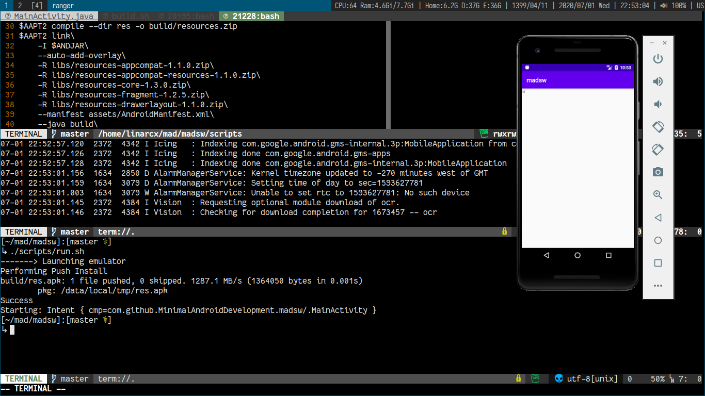

<h4 align="center">
      
</h4>

## Madsw
<h1 align="center">
  
   
  <h4 align="center">Develop madsw with neovim on voidlinux</h4>
</h1>

## Build and use
1. Replace `SDKPATH` variable(in `scripts/build.sh` file) with actual SDK path on your machine.
2. Run build script:
`./scripts/build.sh`

    - This will generate an apk called __res.apk__ in `build` directory.

3. Start an emulator(or connect your Android phone to the computer)
4. `scripts/run.sh`
